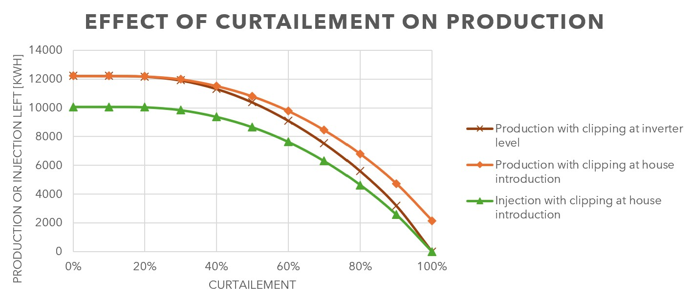

# 🌞✂️ PV Curtailment Study  
**Author:** [Moix P-O](https://www.albedo-engineering.com)  
**Version:** v0.1 — 2025  

---

## 🧭 Overview

This Streamlit web application visualizes and quantifies the impact of **PV power curtailment** — that is, limiting the power injected into the grid or produced by solar panels — using data from a **real residential installation (9.24 kWp)**.

The goal is to **understand production losses** caused by clipping (power limitation) and to simulate **different curtailment strategies** such as:
1. **Capping PV power at the module stage**  
2. **Limiting grid injection while preserving self-consumption**  
3. *(Work in progress)* **Adding storage for smart curtailment compensation**

---

## ⚙️ Features

- Interactive control of PV clipping levels (% of installed capacity)  
- Real-data simulation based on 15-minute measurements  
- Comparison of original vs. curtailed production  
- Visualization of:
  - Solar production and clipping limits
  - Daily and monthly energy balances
  - Grid-feeding limitations
- Streamlit-based, runs locally or in the cloud  
- Modular code — easily extendable for battery and dynamic tariff modeling  

---

## 🚀 Quick Start

### 1️⃣ Requirements
Make sure you have **Python ≥ 3.9** installed.  
Install the required Python libraries:

```bash
pip install streamlit pandas plotly matplotlib
```

> The project also imports a local module `solarsystem.py` — keep it in the same folder.

---

### 2️⃣ Run the App

In your terminal:

```bash
streamlit run streamlit_pv_curtailment.py
```

Then open the local URL displayed (usually <http://localhost:8501>) to view the dashboard.

---

## 🧩 Simulation Logic

| Case | Description | What happens |
|------|--------------|--------------|
| **Case 1** | Curtail at PV DC stage | PV output capped directly from modules |
| **Case 2** | Limit grid injection | Self-consumption preserved, only export limited |
| **Case 3** | Add storage (future) | To be developed — simulate smart battery operation |

---

## 📸 Screenshots

| Simulation | Example Output |
|-------------|----------------|
| Input section |  |
| Results summary |  |

---

## 💡 Background

With Switzerland’s rapidly increasing solar capacity, **daytime PV overproduction** will become significant.  
Curtailment and smart load management will be essential to ensure:
- Grid stability  
- Optimal use of renewable energy  
- Fair economic incentives for prosumers  

For more context, see:  
🔗 [Energy-Charts Switzerland](https://www.energy-charts.info/charts/power/chart.htm?l=en&c=CH)  
🔗 [VSE-AES Recommendation (PDF)](https://www.strom.ch/fr/media/15570/download)

---

## 🧑‍💻 Author Notes

> *“I explored Streamlit — it’s a great tool for quick and interactive dashboards.  
> This app is a first exploration of PV curtailment impacts, built from real data.”*  
>
> — **Moix P-O, Albedo Engineering, 2025**

---

## 📄 License

MIT License — © 2025 Albedo Engineering

You are free to use, modify, and distribute this code under the terms of the MIT License.

---
